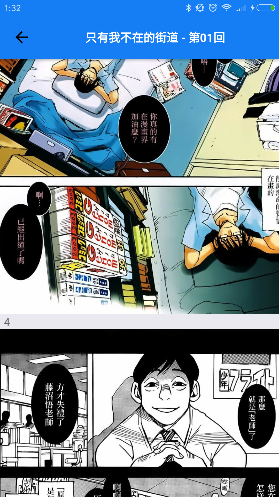

# screenshort 
<a href="screenshot/2.png"><a/>
<a href="screenshot/3.png"><a/><a href="screenshot/4.png"><a/><a href="screenshot/5.png"><a/>
<a href="screenshot/6.png"><a/>

# use
- git clone https://github.com/ztind/ComicApp.git 
- cd ComicApp
- npm install
- npm start
- react-native run-android (or) react-native run-ios

# use library
- redux: <a href="https://github.com/reactjs/redux">reactjs/redux</a>
- redux-thunk: <a href="https://github.com/gaearon/redux-thunk">gaearon/redux-thunk</a>
- react-redux: <a href="https://github.com/reactjs/react-redux">reactjs/react-redux</a>
- react-navigation: <a href="https://reactnavigation.org/docs/intro/">react-navigation</a>
- react-static-container: <a href="https://github.com/reactjs/react-static-container">reactjs/react-static-container</a>
- react-native-viewpager: <a href="https://github.com/race604/react-native-viewpager">race604/react-native-viewpager</a>
- react-native-scrollable-tab-view: <a href="https://github.com/skv-headless/react-native-scrollable-tab-view">skv-headless/react-native-scrollable-tab-view</a>
- react-native-image-picker: <a href="https://github.com/react-community/react-native-image-picker">react-community/react-native-image-picker</a>

